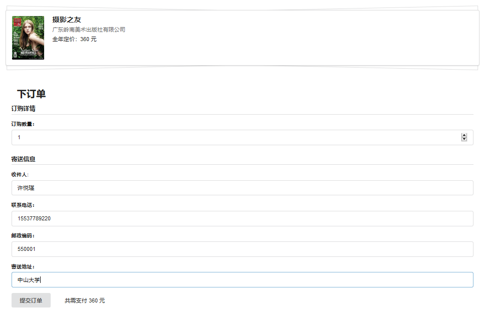

# Post Office
## Dependency
* MySQL5.7
* ASP.NET Core 2 with Entity Framework Core and .Net connector.

## Run
First step, use model and insert SQL files in `glossary/` to construct the database.
Then, run command `dotnet run` under the root directory of PostOffice.
## System modules

## Screenshot
### Customer's view
1. index page

2. keyword search

3. filter

4. make an order

5. pay for an order

### Administrator's view

edit goods' info

